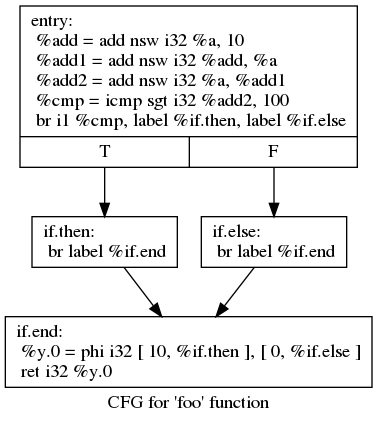
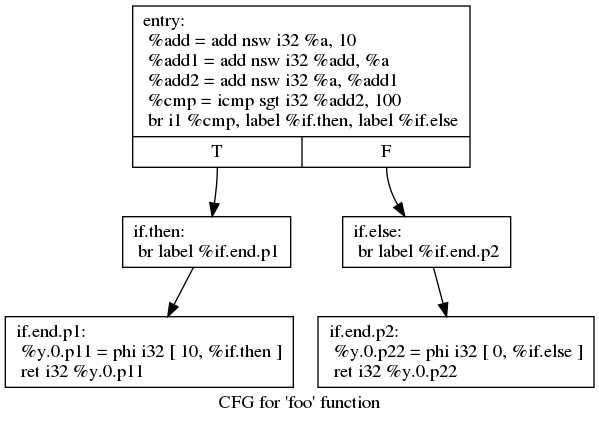

# Demo: CFG Modification


## How is The Modification Looks Like?

Original CFG:


After Modification:


## Usage

```bash
make clean
make
```

Make sure that you have used the correct version of LLVM `opt` (should be 4.0.1). And make sure that you have installed graphviz.