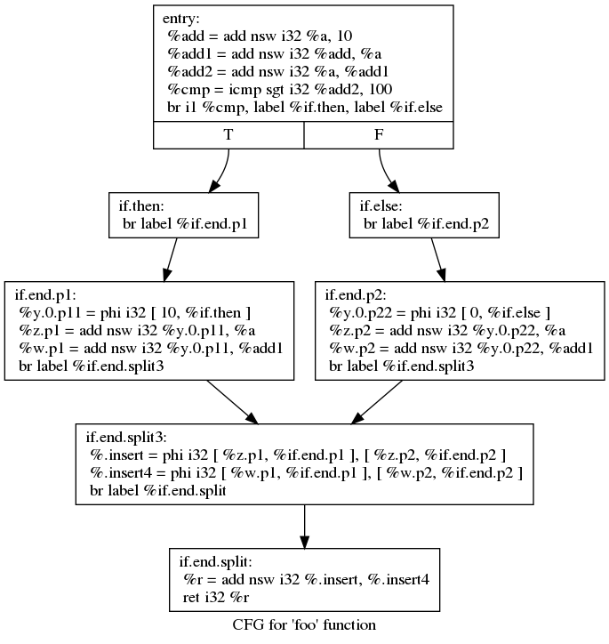
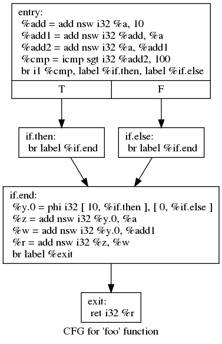
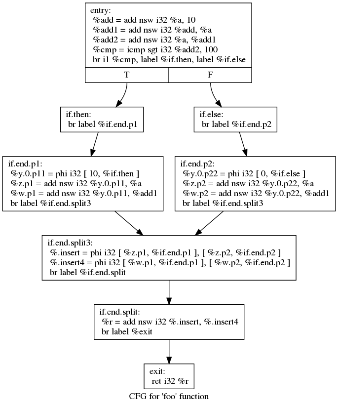
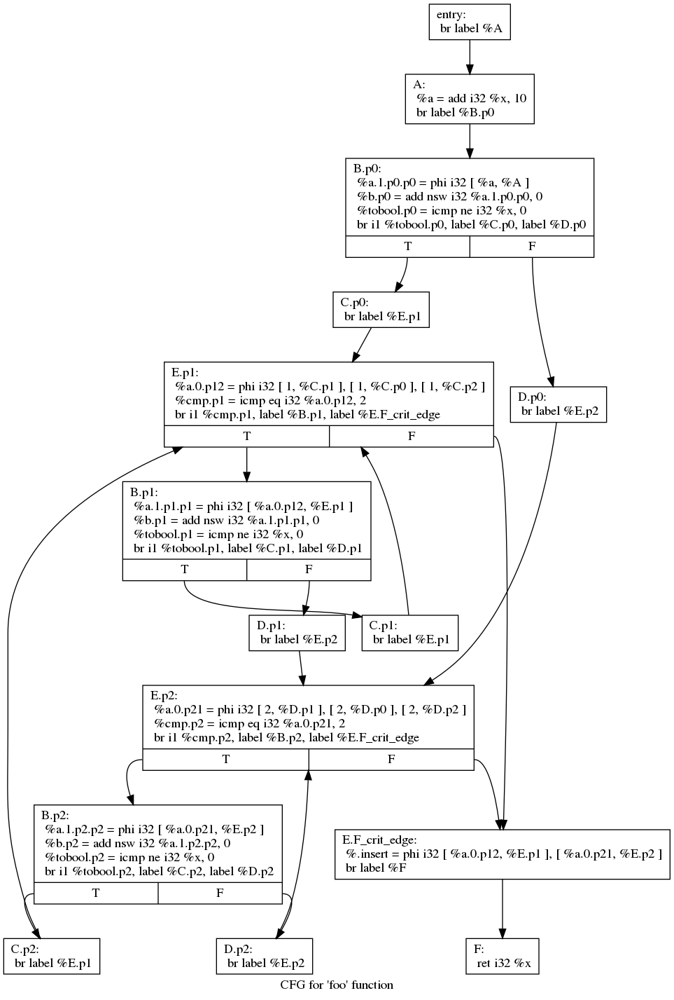

# Demo: CFG Modification


## How is The Modification Looks Like?

### Demo 01 : Single Block (No Successor)

Original CFG:


After Modification:



### Demo 02 : Single Block with Single Successors

Original CFG:


After Modification:


### Demo 3 : A Region of Blocks
Original CFG:


After Modification:



## Usage

```bash
cd /path/to/the/corresponding/demo/directory
make clean
make
```

Make sure that you have used the correct version of LLVM `opt` (should be 4.0.1). And make sure that you have installed graphviz.