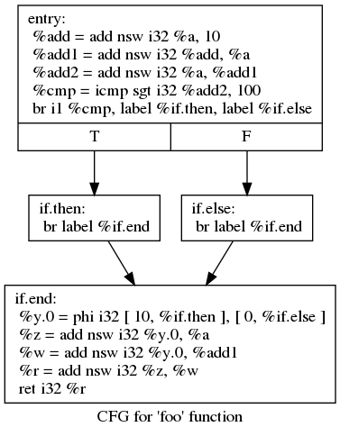
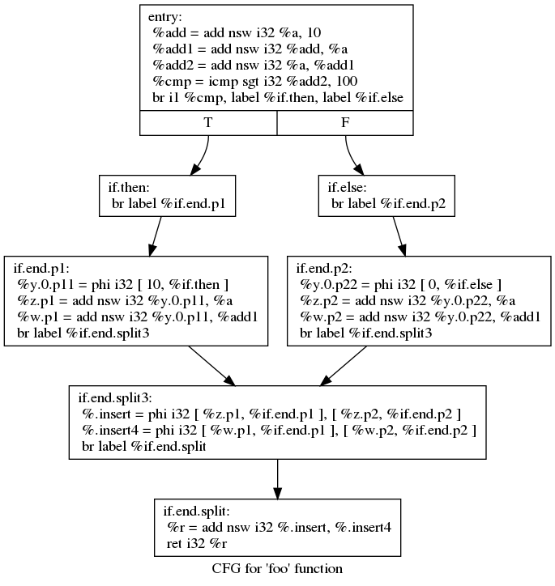
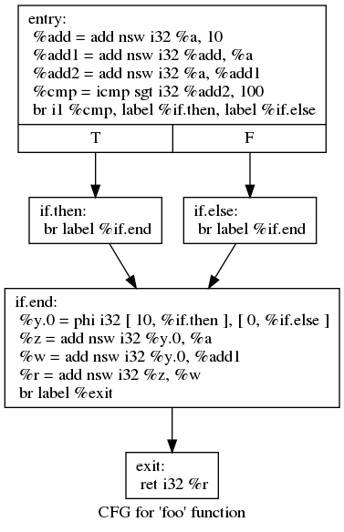
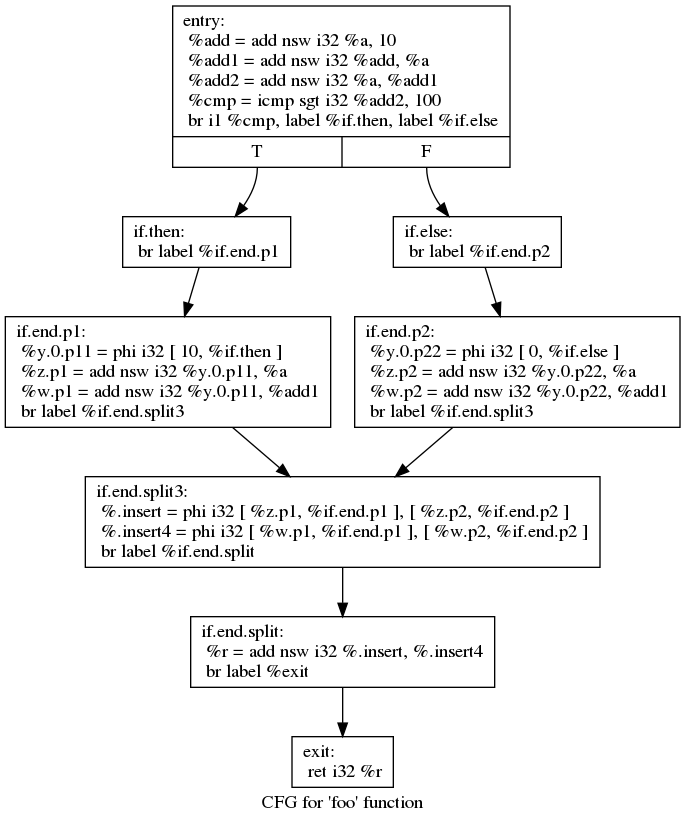
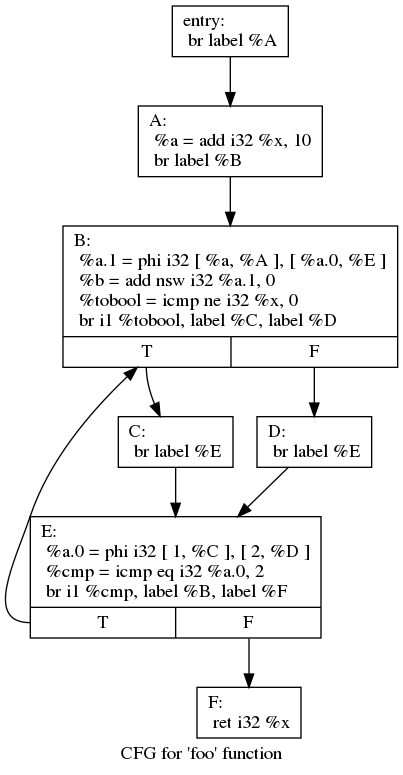
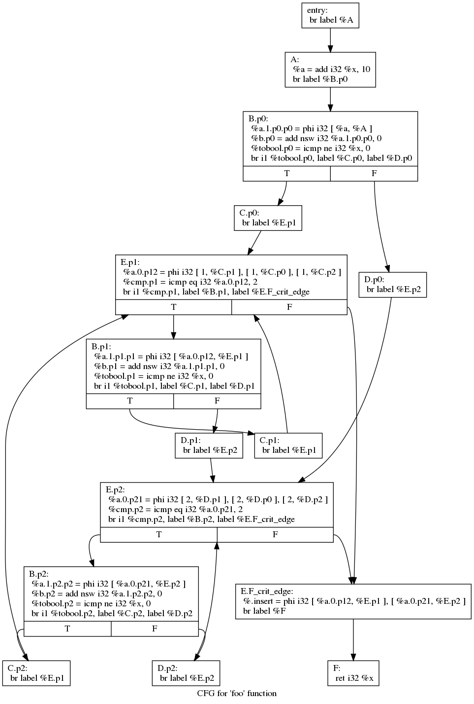

# Demo: CFG Modification


## How is The Modification Looks Like?

### Demo 01 : Single Block (No Successor)

Original CFG:


After Modification:



### Demo 02 : Single Block with Single Successors

Original CFG:


After Modification:


### Demo 3 : A Region of Blocks
Original CFG:


After Modification:


## Quantitative Results

### Execution Time

Execution environment: Ubuntu 18.04 with 16G memory inside Virtual Box 1.2 hosted by a Windows 10 machine with Intel i7-7700@3.600GHz CPU and 32G RAM.

|Test Program | Before Optimization | After Optimization | Reduction |
|---|---|---|---|
|demo01   | 1.828 ns| 1.650 ns | 9.7%|
| demo02  | 1.708 ns  | 1.682 ns | 1.5%|
|demo03   | 1.676 ns | 1.455 ns  | 13.2%|

### Code Size 

|Test Program | Before Optimization | After Optimization | Increase |
|---|---|---|---|
|demo01   | 1,732 bytes  | 1,836 bytes | 5.6%|
| demo02  | 1,740 bytes  | 1,840 bytes | 5.4%|
|demo03   | 1,724 bytes | 1,816 bytes  | 5.1%|

### Constant Propagation

|Test Program | Before Optimization | After Optimization | Increase |
|---|---|---|---|
|demo01   | 0  | 2 | -|
| demo02  | 0  | 2 | -|
|demo03   | 0 | 3  | -|

## Usage

```bash
cd /path/to/the/corresponding/demo/directory
make clean
make
```

Make sure that you have used the correct version of LLVM `opt` (should be 4.0.1). And make sure that you have installed graphviz.